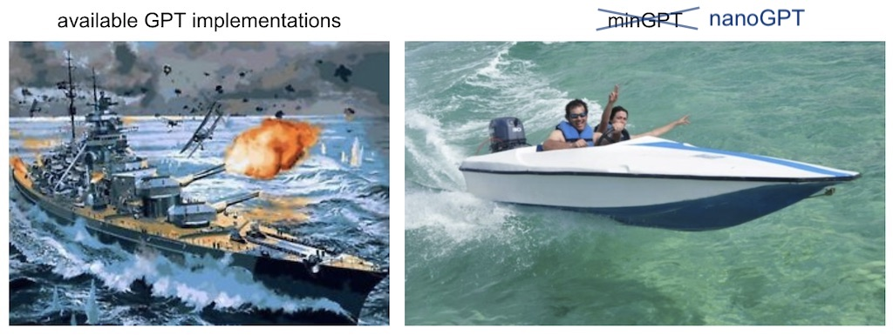

# scrappyGPT | Bigram Model for Character-Level Text Generation



This project implements a bigram model for character-level text generation using PyTorch. The Bigram model predicts the next character in a sequence based on the current character.

This is a super simple implementation of this paper: [Attention Is All You Need](https://arxiv.org/pdf/1706.03762v1.pdf)

The [data](./data/input.txt) used here to train the neural net is a Shakespearean play "Coriolanus" from Act 1, Scene 1 to Act 2, Scene 1.

## Usage

To use this script:

1. Ensure you have PyTorch installed. If not, you can install it via pip: `pip install torch`.

2. Update the hyperparameters according to your requirements. The hyperparameters include:
   - `batch_size`: Batch size for training.
   - `block_size`: Size of the sequence block.
   - `max_iters`: Maximum number of iterations for training.
   - `eval_internals`: Interval for evaluating the loss during training.
   - `learning_rate`: Learning rate for the optimizer.
   - `n_embd`: Dimensionality of the embedding.
   - `n_head`: Number of attention heads.
   - `n_layer`: Number of transformer layers.
   - `dropout`: Dropout probability.

3. Run the script. It will train the Bigram model on the input text data and generate text based on the trained model.

## Description

The script consists of the following components:

- Data Loading: Reads the input text file, encodes characters and prepares the dataset.
- Model Components:
  - `Head`: Represents one head of self-attention.
  - `MultiHeadAttention`: Consists of multiple heads of self-attention in parallel.
  - `FeedForward`: Implements the feedforward network.
  - `Block`: Represents a transformer block consisting of communication followed by computation.
  - `BigramLanguageModel`: Implements the bigram language model.
- Text Generation: Generates text based on the trained Bigram model.

## Run the script

```python
python bigram_model.py
```

## License

This project is licensed under the MIT License - see the [LICENSE](./LICENSE) file for details.

## Acknowledgement

This project was made possible because of [this](https://www.youtube.com/watch?v=kCc8FmEb1nY) lecture by Andrej Karpathy and was inspired by [nanoGPT](https://github.com/karpathy/nanoGPT).

---
Feel free to customize and extend the script according to your specific needs!
